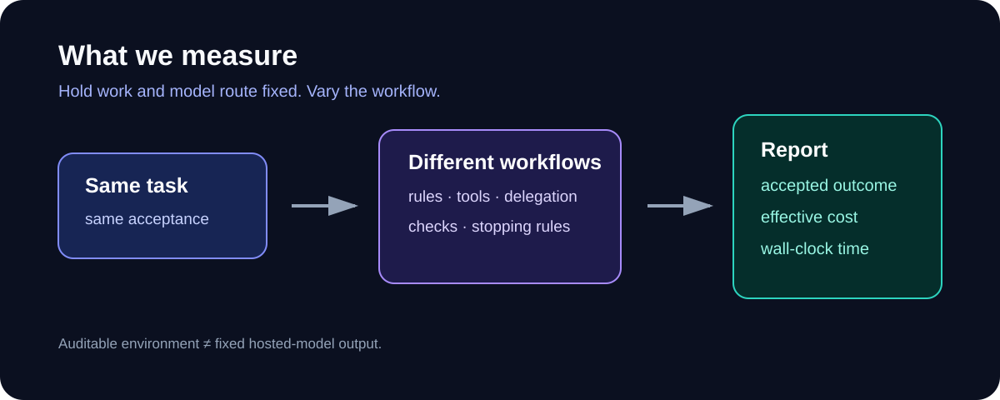

# Agent Workflow Benchmark

[Protocol](docs/PROTOCOL.md) · [Results](docs/RESULTS-HARD-SWEBENCH-VERIFIED-10-2026-08-12.md) · [Roadmap](ROADMAP.md)



> Same work. Different workflows. Measure accepted outcome, effective cost, and wall-clock time.

Model benchmarks measure a model. This measures the delivered workflow around
one model route: instructions, delegation, tools, checks, and stopping rules.
It answers whether that workflow changes the requested product outcome.

## Latest verified round

**Hard SWE-bench Verified — 10 frozen issues × 4 workflows × 1 route × 1 run.**
GSD resolved **2/10**; Codex control, LHC, and Superpowers resolved **1/10**.
This is not a universal winner claim.

The round uses real repository issues, sanitized one-commit Git histories,
official hidden-test grading, pinned images, and 40 published redacted receipts.
[Method and per-task evidence](docs/RESULTS-HARD-SWEBENCH-VERIFIED-10-2026-08-12.md).

## What is measured

- **Quality** — did the acceptance contract pass?
- **Cost** — what was actually charged? Unknown stays unknown.
- **Time** — how long did the work take?

No composite score is authoritative. Process compliance, token count, and an
LLM judge are not product success.

## Current boundary

- The 10 hard tasks are now **frozen calibration**, not a final test set.
- One route and one repeat do **not** measure variance or a general workflow effect.
- The harness is reproducible and each run auditable. Hosted-provider outputs
  may change over time; exact output reproducibility is not claimed.

## Next proof

The next headline campaign is **40 held-out tasks × 3 repeats × 3 model
families × the same frozen workflows**. It will publish per-family results and
uncertainty, not one global winner. [Roadmap](ROADMAP.md).

## Run locally

```bash
python3 -m pip install -e .
python3 scripts/run_campaign.py configs/manifest.docker-smoke.yaml --output results/smoke
```

This deterministic smoke run checks Docker isolation, receipts, acceptance,
budget accounting, and archive creation. It is not a model-quality result.

## Sources and details

- [Protocol](docs/PROTOCOL.md)
- [Runner contract](docs/RUNNER.md)
- [Result schema](docs/RESULT_SCHEMA.md)
- [Why this benchmark](docs/WHY-BENCHMARKS.md)
- [Research catalogue](research/README.md)

MIT — [LICENSE](LICENSE).
